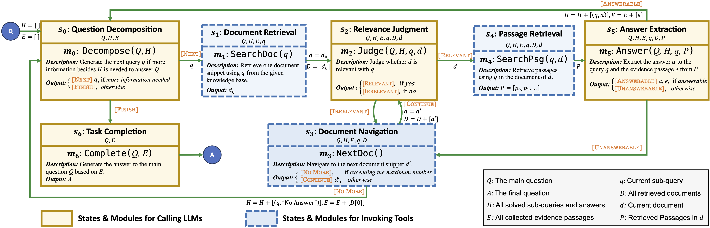
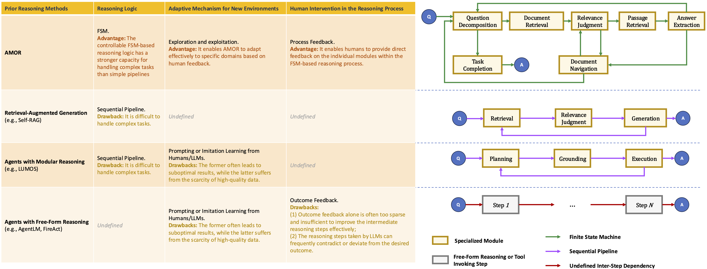
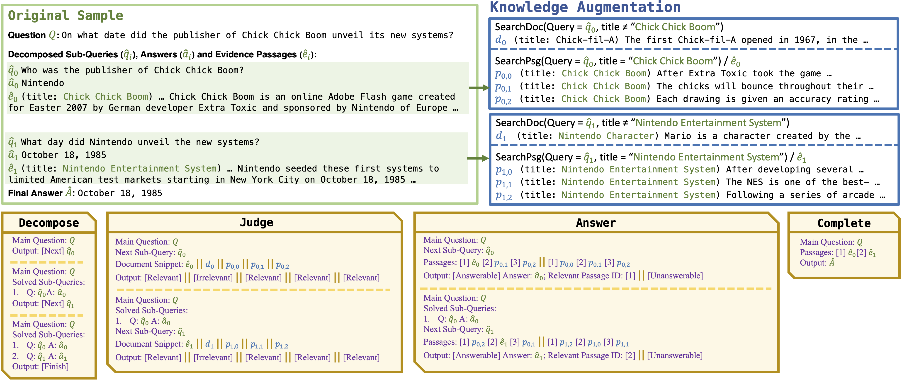
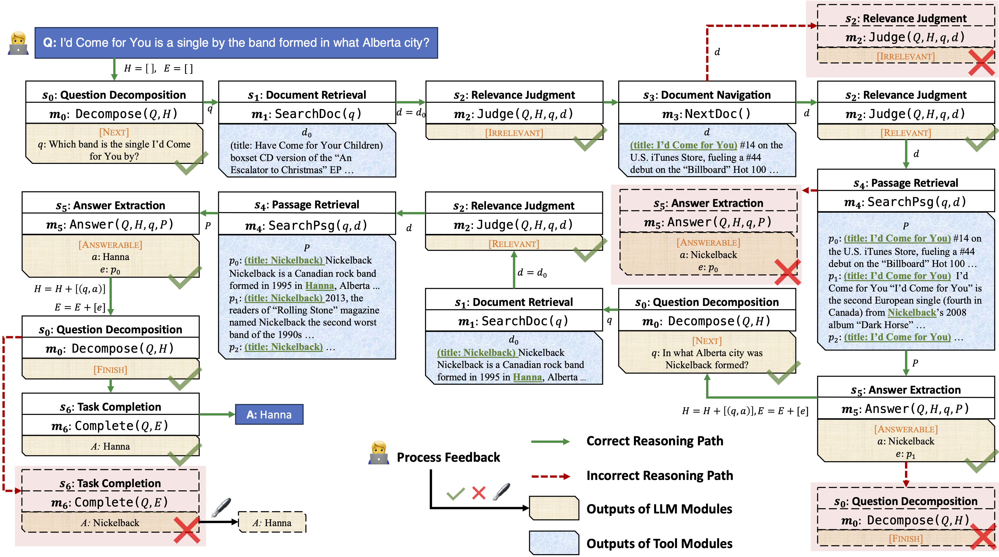

# **AMOR**: A Recipe for Building **A**daptable **MO**dula**R** Knowledge Agents Through Process Feedback

This repo provides the data and codes for our [NeurIPS 2024 work](https://arxiv.org/abs/2402.01469).

The notable success of large language models (LLMs) has sparked an upsurge in building language agents to complete various complex tasks. We present AMOR, an agent framework based on open-source LLMs, which reasons with external knowledge bases and adapts to specific domains through human supervision to the reasoning process. AMOR builds reasoning logic over a finite state machine (FSM) that solves problems through autonomous executions and transitions over disentangled modules. This allows humans to provide direct feedback to the individual modules, and thus naturally forms process supervision. Based on this reasoning and feedback framework, we develop AMOR through two-stage fine-tuning: warm-up
and adaptation. The former fine-tunes the LLM with examples automatically constructed from various public datasets, enabling AMOR to generalize across different knowledge environments, while the latter tailors AMOR to specific domains using process feedback. Extensive experiments across multiple domains demonstrate the advantage of AMOR to strong baselines, thanks to its FSM-based reasoning and process feedback mechanism.





Related papers:

- [Data sythesis for VLM reasoning](https://arxiv.org/abs/2406.19934)
- [Scaling Code-form Planning for LLM reasoning](https://arxiv.org/abs/2409.12452)


## Environment Preparation

```shell
conda env create -f retriever.yaml
conda env create -f warmup.yaml
conda env create -f adaptation.yaml
```


Next we take HotpotQA as an example to illustrate how we build the AMOR agent.

## I. Retriever Deployment

1. Download the contriever-msmarco model from [HuggingFace](https://huggingface.co/facebook/contriever-msmarco) to `./model/contriever-msmarco`.

2. Download data to `./data/retriever`, including [psgs_w100.tsv](https://dl.fbaipublicfiles.com/dpr/wikipedia_split/psgs_w100.tsv.gz), [wikipedia_embeddings](https://dl.fbaipublicfiles.com/contriever/embeddings/contriever-msmarco/wikipedia_embeddings.tar) (DO NOT FORGET TO DECOMPRESS THEM. REFER TO [OFFICIAL REPO](https://github.com/facebookresearch/contriever) FOR MORE DETAILS) and [entity2id.json](https://drive.google.com/file/d/1G65G_FoEZOLHqrXVDs8JsjflhqdEOJso/view?usp=sharing).

3. Execute the following script:

   ```bash
   conda activate retriever
   cd ./retriever
   python3 ./deploy.py ### DO NOT FORGET TO COMPLETE `data_path` and `model_name_or_path`. YOU CAN CUSTOMIZE YOUR `appname`, `port` and `device`
   
   python3 ./test_deploy.py ### TEST WHETHER THE RETRIEVER IS SUCCESSUFULLY DEPLOYED
   ```

   

## II. Warm Up Fine-Tuning

1. Download `Llama` model from [HuggingFace](https://huggingface.co/meta-llama/Llama-2-7b-chat-hf)

2. Download [warm-up data](). We have prodived preprocessed data `./data/warmup/warmup_data.json` for warm-up fine-tuning. You can use `./data/warmup/pro_data.py` to customize the process.

   

3. Execute the following script:

   ```bash
   conda activate warmup
   cd ./code
   bash ./warmup.sh
   ```

   The trained model will be saved under `./model/warmup_model`


## III. Adaptation Fine-Tuning

### 1. Exploration

Execute the following script:

```bash
conda activate adaptation
cd ./code
env CUDA_VISIBLE_DEVICES=0 CUDA_LAUNCH_BLOCKING=1 python3 -u ./run.py \
	--train_file ../data/hotpotqa/train.json \
	--dev_file ../data/hotpotqa/dev.json \
	--test_file ../data/hotpotqa/test.json \
	--split train \
	--eval 0
```

DO NOT forget to set the `ckpt_dir` field in `./code/init_args.py` to the path to the warm-up model. Then the resulting trajectories will be saved in `./result/explore_train.json`. 

Additionally, we also provide the trajetories from the warm-up model  and the adaptation model on the HotpotQA test set in `./result/explore_test_warmup.json` and `./result/explore_test_adaptation.json`, respectively, which can be used to reproduce the results reported in the main paper.

### 2. Process Feedback Annotation

Execute the following script:

```bash
cd ./code
python3 ./get_reward.py
```

This script will annotate the reward automatically for `./result/explore_train.json` and save the result in `./result/explore_train_reward.json`.



### 3. Exploitation

Execute the following script:

```bash
conda activate adaptation
cd ./code
bash ./exploit.sh
```

The trained model will be saved under `./model/adaptation_model`.


## IV. Evaluation

Execute the following script:

```bash
conda activate adaptation
cd ./code
python3 -u ./run.py \
	--eval_file ../result/explore_test_adaptation.json.json \
	--eval 1
```

DO NOT forget to set the `ckpt_dir` field in `./code/init_args.py` to the path to the evaluated model. 


## How to Cite

Please kindly cite our paper if this paper and it is helpful. It's our honor to help you better explore agent building with our implementation.

```tex
@misc{guan2024amorrecipebuildingadaptable,
      title={AMOR: A Recipe for Building Adaptable Modular Knowledge Agents Through Process Feedback}, 
      author={Jian Guan and Wei Wu and Zujie Wen and Peng Xu and Hongning Wang and Minlie Huang},
      year={2024},
      eprint={2402.01469},
      archivePrefix={arXiv},
      primaryClass={cs.CL},
      url={https://arxiv.org/abs/2402.01469}, 
}
```